# Data-Driven NPC Gossip, Reputation & Social Simulation Engine

A highly decoupled social simulation engine built natively in **Unity 6** using the Universal Render Pipeline (URP), intended for release as a modular **Unity Asset Store** package.

The core architectural goal of this project is an advanced town ecosystem where non-player characters autonomously witness player deeds, propagate rumors to nearby NPCs, track player reputation (general, per-faction, and per-NPC personal opinion), and react through a fully scripted, **deterministic** dialogue and animation system — no AI/LLM components anywhere in the runtime loop. Movement, interaction, vendor trading, and quest-giving are all optional, independently-removable add-ons layered on top of a Core that has zero compile-time dependency on any of them.

---

## 🛠️ Technical Milestones Achieved So Far

### Foundation & Dependency Injection
* **Clean Project Framework** — isolated `Assets/_Project/` directory architecture separating foundational code from external assets.
* **VContainer Integration** — `GameLifetimeScope` + a non-MonoBehaviour `GameBootstrapper` as the single Composition Root, guaranteeing frame-zero initialization safety.
* **Scene Injection Scanner** — `RegisterComponentInHierarchy<T>` wired into the Composition Root to automatically discover and inject every scene-bound NPC on boot.

### Gossip & Reputation
* **Static + Dynamic Rumors** — hand-authored `RumorTemplate` assets alongside player-deed-witnessed rumors (`PlayerDeedBroadcaster` → `NPCGossipMemory.LearnRumor`).
* **Private NPC Memory** — `NPCGossipMemory` indexes known rumors per-NPC by unique key, tracking credibility and share state independently per NPC.
* **Three-Tier Response System** — a rumor's own specific responses, falling back to `GeneralRumorResponseLibrary`'s Positive/Negative pools (selected by the *reacting NPC's current view of the player*, not the rumor's own alignment), with per-NPC repeat-avoidance.
* **Reputation System** — `ReputationService` tracks General and per-Faction reputation; `NPCReputationOpinion` layers a decaying personal "witness modifier" and a cooldown-gated greet boost on top, resolving to a shared `ReputationTier` enum (Hated → Disliked → Neutral → Liked → Trusted).

### Interaction & Dialogue
* **`[E]` Interaction Framework** — `NPCProximityGossip` drives proximity detection, a fading world-space prompt, and dispatch to whichever add-on (Vendor, Quest Giver) or fallback (scripted dialogue, ambient greeting) should handle the interaction, resolved by `NpcAddonRegistry` via `IInteractionExtension.InteractionPriority`.
* **Dialogue Menu** — `DialogueMenuUI` + `DialogueMenuUIWizard` for generating/auto-wiring the UI; dialogue/audio pairing per response.

### Data-Driven Animation
* **`NPCAnimationBridge`** — `CrossFade`-based motion blending by state name (no rigid transition graphs), with automatic **per-state Animator layer resolution** (a state can live on any layer; the bridge finds it) and a variance pool for randomized idle/gesture selection.
* **Tone-Driven Reactions** — `GossipToneData` ScriptableObjects drive `PlayOnce`/`Loop`/`None` playback modes for rumor and witness reactions.
* **Startup & Culling Fixes** — Animator Culling Mode forced to `AlwaysAnimate` at runtime; startup pose selection moved to `Start()` for correct Animator initialization timing.

### Locomotion Add-on (Optional, Fully Removable)
* **Core Movement** — `LocomotionAgent` (NavMeshAgent-driven), `LocomotionRoute`/`LocomotionWaypoint` data, with Editor-side Scene handles for authoring routes.
* **Natural Movement Feel** — a 2D Freeform Blend Tree (Speed × Turn), Animator parameter damping, an arrival deceleration ramp, a discrete one-shot Stop animation, and **corner anticipation** (redirects to the next waypoint before full arrival, so the NPC curves through corners instead of pivoting sharply).
* **Per-Pose Playback Rate** — a live, per-clip Animator State Speed multiplier resolved from Unity's own current blend weights (`GetCurrentAnimatorClipInfo`), synced from a selected Blend Tree via a custom Editor section.
* **Point of Interest Groundwork** — `LocomotionWaypoint.IsPointOfInterest`/`StopBehavior`/`StopChance` fields reserved for a planned future mechanic; actual stop-or-flow-through behavior today is driven by `LingerDuration` (`0` = pass through, `> 0` = decelerate, stop, wait, continue).
* **`[E]` Interaction Integration** — a new Core-defined `INpcMovementController` interface (implemented only by `LocomotionAgent`, resolved by Core via plain `GetComponent<T>()`, zero reflection) lets `NPCProximityGossip` pause/resume movement and swap a walking NPC onto its idle pool for the duration of a conversation, resuming on dialogue close or the player walking away. A **running** NPC is never interactable at all.

### Editor Tooling
* **`NPCCreatorWizardWindow`** — generates full NPC prefabs (Common / Vendor / Quest Giver / Non-Dialogue), with dynamic add-on detection.
* **`NPCControlPanelWindow`** — categorized runtime/debug inspector across all attached add-ons.
* **Custom Inspectors** — `LocomotionRouteEditor`, `LocomotionAgentEditor` (Blend Tree pose sync, individual-state Speed editing), `NPCAnimationBridgeEditor` (real Animator-state dropdowns instead of typed strings, auto-resolving Animator references).
* **Reusable Drawers** — `[AnimatorStateName]`/`[AnimatorParameterName]` attributes render as live dropdowns anywhere they're used, project-wide.

### Testing
* Standalone test harnesses (`GossipTester`, `ReputationTester`, `DeedTester`, `LocomotionTester`) validating each system's real end-to-end trigger paths independent of full gameplay wiring.

---

## 🏗️ Core Architecture Overview

The system is strictly split into **Immutable Templates** (static ScriptableObject assets on disk) and **Runtime State** (per-NPC memory instances at play time), composed entirely through VContainer — no global singletons anywhere.

```mermaid
flowchart TB
    subgraph DI["Composition Root"]
        GLS["GameLifetimeScope"]
        GB["GameBootstrapper"]
    end

    subgraph Services["Core Services (Injected Singletons)"]
        GM["GossipManager"]
        RS["ReputationService"]
    end

    GLS --> GB
    GLS -->|registers| Services
    GB -->|"RegisterComponentInHierarchy&lt;T&gt;<br/>scans scene on boot"| NPC

    subgraph NPC["Per-NPC Core Components"]
        Registry["NpcAddonRegistry"]
        Memory["NPCGossipMemory"]
        Opinion["NPCReputationOpinion"]
        Proximity["NPCProximityGossip"]
        AnimBridge["NPCAnimationBridge"]
        Witness["NPCWitnessReaction"]
        Greeter["NPCGreetingResponder"]
    end

    Services -.->|inject| Memory
    Services -.->|inject| Opinion

    subgraph Templates["Immutable Templates (Assets)"]
        Rumor["RumorTemplate"]
        Tone["GossipToneData"]
        Archetype["NPCArchetypeConfiguration"]
        RespLib["GeneralRumorResponseLibrary"]
    end

    subgraph RuntimeState["Runtime State (Memory)"]
        RumorState["RuntimeRumorState"]
    end

    Memory -->|reads| Rumor
    Memory -->|tracks| RumorState
    Memory -->|fallback pool| RespLib
    AnimBridge -->|reads| Tone
    Witness -->|reads| Rumor

    Proximity -->|"[E] opens"| DialogueUI["DialogueMenuUI"]
    Proximity -->|"resolves handler via<br/>InteractionPriority"| Registry

    subgraph AddOns["Optional Add-ons (attach via interfaces, never referenced directly by Core)"]
        Locomotion["LocomotionAgent<br/>(implements INpcMovementController)"]
        Vendor["VendorComponentAddon<br/>(implements IInteractionExtension, INpcAddon)"]
        Quest["QuestComponentAddon — planned<br/>(implements IInteractionExtension, INpcAddon)"]
    end

    Registry -.->|discovers| Vendor
    Registry -.->|discovers| Quest
    Proximity -.->|"GetComponent&lt;INpcMovementController&gt;()<br/>pause/resume, no reflection"| Locomotion

    subgraph EditorTools["Editor Tooling"]
        Wizard["NPCCreatorWizardWindow"]
        Panel["NPCControlPanelWindow"]
        RouteEd["LocomotionRouteEditor / LocomotionAgentEditor"]
        BridgeEd["NPCAnimationBridgeEditor"]
    end

    Wizard -.->|generates| NPC
    Wizard -.->|generates| AddOns
```

**Reading the diagram:** solid arrows are hard runtime dependencies (Core → Core, or Core → Templates/Runtime State). Dotted arrows are **interface-mediated** — Core never holds a compile-time reference to any add-on's concrete type; every add-on depends on Core by *implementing* a Core-defined interface (`IInteractionExtension`, `INpcAddon`, `INpcMovementController`), never the reverse. Deleting any single add-on script leaves every other system compiling and functioning correctly.

---

## 📦 Modular Add-on Pattern

Every add-on plugs into Core through one of three interfaces, resolved via plain `GetComponent<T>()` (no reflection needed, since Core owns the interface definitions):

| Interface | Purpose | Implemented By |
|---|---|---|
| `INpcAddon` | Marks a component as a discoverable NPC add-on, cached by `NpcAddonRegistry` | `VendorComponentAddon`, planned `QuestComponentAddon` |
| `IInteractionExtension` | Lets an add-on hijack the `[E]` interaction, with designer-controlled priority when more than one is present | `VendorComponentAddon`, planned `QuestComponentAddon` |
| `INpcMovementController` | Lets Core pause/resume movement and query running state | `LocomotionAgent` |

**Status:** Locomotion is fully implemented and integrated with interaction. Vendor and Quest Giver exist as stubs (component + interface implementation) without their full feature sets yet (see Roadmap).

---

## 🎮 Interaction Flow

1. Player enters an NPC's trigger zone → `NPCProximityGossip` checks `INpcMovementController.IsRunning` (if present) — a **running** NPC shows no prompt and cannot be interacted with at all.
2. An `AutoProximity` rumor, if available, presents immediately; otherwise the `[E]` prompt fades in.
3. On `[E]`: if this NPC has Locomotion, movement pauses and it drops into its idle pool (visually identical to a non-Locomotion NPC) for the whole interaction.
4. `NpcAddonRegistry` resolves the highest-priority `IInteractionExtension`, if any (Vendor/Quest), otherwise the dialogue menu opens or an ambient greeting plays.
5. On dialogue close **or** the player walking out of range mid-conversation: movement resumes and the idle-pool override releases, letting Locomotion's own animation take over again.

---

## 🚧 Roadmap / Known Gaps

* **Vendor Add-on** — currently a placeholder inventory array; full buy/sell flow and reputation-driven pricing/denial not yet implemented.
* **Quest Giver Add-on** — referenced by name in Core's reflection-safe checks, but the type doesn't exist yet.
* **Emotional State Component** (Fear/Happiness/Indifference, defaulting gracefully without Reputation installed) — not yet implemented.
* **Guard Aggression** — reputation-driven guard behavior not yet implemented.
* **Point of Interest Mechanic** — data fields exist on `LocomotionWaypoint`; the actual behavior they'll drive (beyond today's `LingerDuration`-based stopping) is planned but not yet built.
* **Flocking/Fleeing on Combat or Crime** — not yet implemented for the Locomotion add-on.
